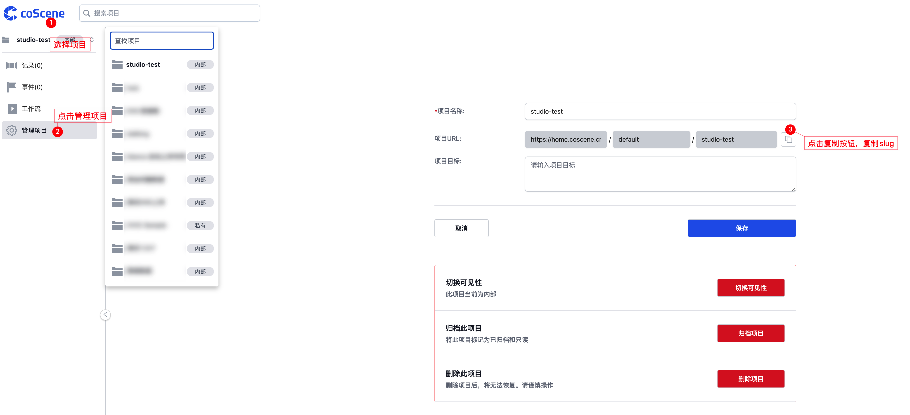
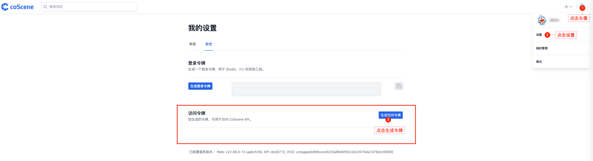
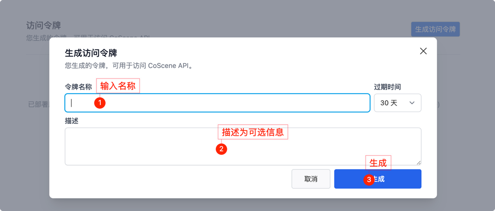
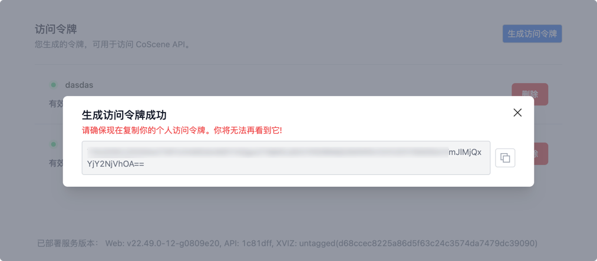
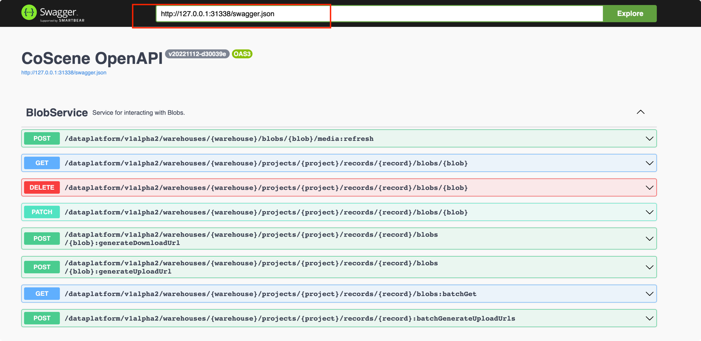

# Sample files to upload

## 依赖
```shell
make install
```

## 配置
创建一个文件在~/.cos.ini

```ini
[default]
server_url = https://openapi.keenon.coscene.cn
project_slug = <WAREHOUSE/PROJECT>
api_key = <API_KEY>
```
替换上面带尖括号的里的内容

配置文件按照一下顺序搜索

### 从Project设置获得slug


### 从 coscene 网页右上角 点击头像 -> 设置 -> 安全 里生成一个对应的 apikey 使用




## 本地调试

配置好以上 `.cos.ini` 后

```shell
# 手动上传文件到 coscene
$ python main.py ./examples/sample_data/2.jpg ./examples/sample_data/3.jpg      
```

### 服务模式

```shell
$ python main.py --daemon --base-dir <base dir> --mode=<client id>
```

将会启动一个服务检测 `<base dir>` 目录。用户可以将上传请求写入这个目录，文件格式为：

```json
{
  "recordName": "上传后的记录名称",
  "bag": [
    "bag1.bag",
    "bag2.bag"
  ],
  "log": [
    "log1.log",
    "log2.log"
  ]
}
```

每当新 JSON 文件在 `<base dir>` 被创建，刻行将创建新的记录并上传 bag 和 log 文件

## 部署到一台Ubuntu操作系统的机器人
- 本地电脑（执行端）需要安装 `ansible`
- 本地电脑（执行端）需要修改`inventory`文件
请参考 [Ansible Inventory 文件](https://ansible-tran.readthedocs.io/en/latest/docs/intro_inventory.html)
以及 [How to build your inventory](https://docs.ansible.com/ansible/latest/inventory_guide/intro_inventory.html)
```yaml
robots:
  hosts:
    MACHINE-1:
      ansible_host: 10.16.10.15
      ansible_user: ecs-user
    MACHINE-2:
      ansible_host: ngrok.com
      ansible_port: 45678
      ansible_user: root
    MACHINE-3:
  vars:
    server_url: https://api.coscene.cn
    project_slug: <WAREHOUSE/PROJECT>
    api_key: <API_KEY>
    base_dir: <THE_DIRECTORY_TO_MONITOR>
```
以上hosts下的每一台机器，都需要copy您的ssh key才能够免密部署。
如果你使用git，可能你已经有ssh key了。替换以下的用户，机器ip，端口部分。
```shell
ssh-copy-id -o StrictHostKeyChecking=no <user>@<machine-ip>:<port>
```
经过如上部署后，执行以下指令即可批量部署
```shell
make ansible
```

## Swagger
Swagger 是 SmartBear 软件公司为 API 开发者提供的一套工具，也是 OpenAPI 规范所依据的一个规范。本地启动一个 server 提供获取 swagger.json 文件，为 ui 渲染做文件准备。

1. 启动本地 server，`python server.py` 
2. 浏览器打开网址 [swagger](https://petstore.swagger.io/)
3. 输入地址 `http://127.0.0.1:31338/swagger.json` 查看即可获取到接口文档


